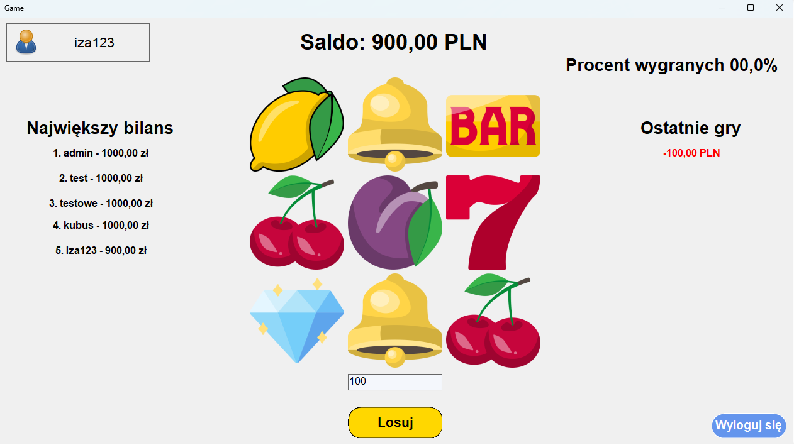

# 🎰 Casino Simulator (Slot Machine & Database System)

A desktop-based casino simulation application built in C# using Windows Forms, featuring a fully functional Slot Machine game linked to a MySQL database. This project was developed as a collaborative school assignment to demonstrate full-stack principles using desktop application design and relational database management.

## 📷 Screenshots

Below is the main gameplay interface with live balancing, statistics, a leaderboard, and the slot machine reels:

| Main Gameplay & Leaderboard Interface |
| :---: |
|  |

---

## ✨ Features
* **User Authentication:** Login and register system mapped to secure database records.
* **Interactive Slot Machine:** A dynamic 3x3 grid utilizing premium randomized asset generations (Lemons, Bells, BARs, Cherries, Plums, 7s, Diamonds).
* **Live Wallet & Betting System:** Custom betting input that safely updates the user's real-time balance.
* **Global Leaderboard:** Automatically queries and renders the top 5 highest-ranking players directly from the database server.
* **Performance Analytics:** Tracks win/loss percentage statistics and displays financial differentials for the latest games.

---

## 🛠️ Tech Stack
* **Frontend/UI:** C# (Windows Forms)
* **IDE:** Visual Studio
* **Backend Database:** MySQL (Managed via XAMPP)

---

## ⚙️ How to Setup and Run

### Prerequisites
To run this application locally, you must have the following tools installed:
1. **Visual Studio:** [Download here](https://visualstudio.microsoft.com/) (Make sure the `.NET Desktop Development` workload is selected).
2. **XAMPP Server:** [Download here](https://www.apachefriends.org/) (Required for running the local MySQL database instance).

---

### Step-by-Step Installation

#### 1. Database Configuration (XAMPP)
1. Open the **XAMPP Control Panel**.
2. Click **Start** next to both **Apache** and **MySQL**.
3. Open your web browser and navigate to: `http://localhost/phpmyadmin/`.
4. Click on **New** in the left sidebar to create a new database.
5. Name the database precisely: `roulettedb` and click **Create**.
6. Select your newly created `roulettedb`, go to the **Import** tab at the top.
7. Click **Choose File** and locate the SQL schema file within the project directory at:
   ```text
   Ruletka/Ruletka/users.sql
   ```
8. Scroll to the bottom and click **Import** (or **Go**).

#### 2. Running the Desktop Application
1. Clone or download this repository to your local machine.
   ```bash
   git clone https://github.com/IzabelaxKo/roulette-csharp.git
   ```
2. Open the project folder and launch the `.sln` (Solution) file using **Visual Studio**.
3. In Visual Studio, ensure all local database connection strings inside your codebase point to `localhost` with the corresponding `roulettedb` database name.
4. Press the green **Start** button or hit `F5` on your keyboard to build and launch the application.
